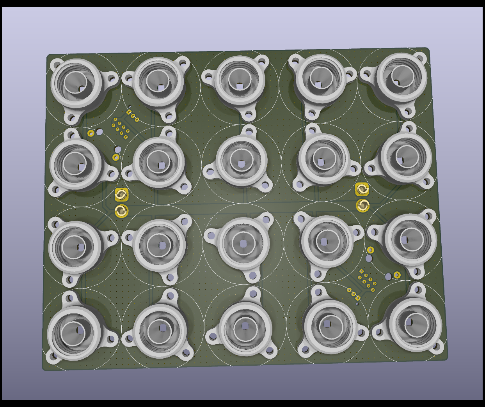

Klopfer Light
=============

Inspired by https://www.printables.com/model/1125977-led-cap-for-small-bottles-with-m18-thread-for-ws28 and the Mate Light https://github.com/jaseg/matelight , this design aims to provide a draft for a 4x5 crate backplane.

To be followed up with some controller and firmware design ;)
